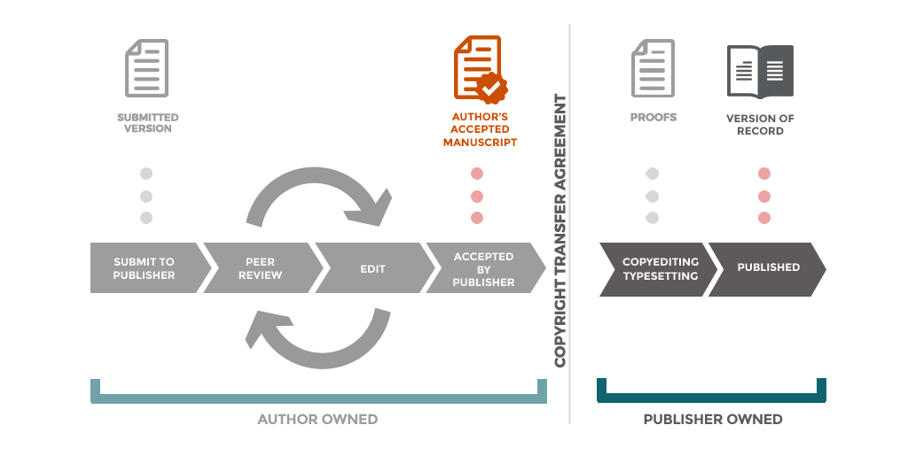

## Introduction

Rights Retention (RR) is an approach to scholarly publishing that enables authors and institutions to **retain sufficient rights over research outputs** to make them openly available and reusable. It typically allows authors to share their **Author Accepted Manuscript (AAM)** through repositories under open licences such as CC BY [@coalition_s_rrs].

**Institutional Rights Retention** is where an institution requires and supports participation in rights retention, usually by retaining rights and applying a licence on behalf of an author. This approach ensures authors are protected from administrative burden and licensing negotiations with the publisher. Institutional Rights Retention is practiced widely across the UK and increasingly globally [e.g. @glasgow_oa; @unimelb_rr; @n8_faq].

At Southampton, Rights Retention is supported through an **institutional rights retention environment**, rather than a single standalone policy. This includes:

-   An **institutional licence** applied to journal articles and conference proceedings\
-   Updates to IP regulations and the Open Access policy\
-   A repository deposit agreement enabling author-controlled licensing

This approach ensures that:

-   Articles and conference proceedings are covered by a **prior institutional licence**
-   Authors may still apply open licences to **other works voluntarily**, provided they deposit before entering restrictive agreements

The FAQs below address both core Rights Retention principles and **adjacent concerns**, including commercial reuse, derivative works, and potential misuse.

------------------------------------------------------------------------

## 1. Core concepts

::: {.callout-note collapse="true"}
### What is Rights Retention?

Rights Retention enables authors to **retain key copyright permissions**, allowing them to share and reuse their work openly via repositories [@unimelb_rr; @n8_faq].
:::

::: {.callout-note collapse="true"}
### Why is Rights Retention needed?

Traditional publishing agreements often require authors to assign exclusive rights to publishers, restricting reuse. Rights Retention ensures authors can **control dissemination and meet open access requirements** [@n8_faq].
:::

::: {.callout-note collapse="true"}
### What are the main benefits?

-   Immediate or embargo-free open access\
-   Simplified compliance with funder policies\
-   Increased visibility and impact\
-   Freedom to reuse work in teaching and future research [@jisc_irrp; @glasgow_oa]
:::

------------------------------------------------------------------------

## 2. Scope and applicability

::: {.callout-note collapse="true"}
### What outputs are covered?

Rights Retention policies typically apply to **journal articles and conference proceedings (with ISSNs)** [@jisc_irrp]. We have chosen to adopt this model for in-scope works at the University of Southampton. We have created a policy environment which gives authors the option to apply open licenses to more diverse works, if they choose to.
:::

::: {.callout-note collapse="true"}
### Which version is shared?

Usually the **Author Accepted Manuscript (AAM)**, which is the peer-reviewed version prior to typesetting [@openaccess_nl].\
\
{fig-alt="A visual representation of a simplified publishing workflow demonstrating the transfer of ownership and which version is the Author Accepted Manuscript (AAM)" fig-align="center" width="800"} Created by the Office of Scholarly Communication, Cambridge University Libraries, available under a CC BY licence [@smith2018manuscript].
:::

::: {.callout-note collapse="true"}
### Does this apply to all research outputs?

#### At other institutions

Not necessarily. Other outputs (e.g. books, book chapters, software, websites, creative works etc.) are often out of scope but some institutions are pioneering the inclusion of books and book chapters.

#### At the University of Southampton

##### In-scope

Journal articles and papers in a conference proceeding with an ISSN are explicitly in-scope of the policy. Exceptions may be applied with written agreement to accommodate the needs of the author and work.

##### Out-of-scope

All other research outputs are explicitly out-of-scope of the prior licence granted to the institution. However, if the author chooses it, the institution is granted the right to apply an open licence to out-of-scope research outputs deposited in the institutional repository.

Note, out-of-scope outputs may be subject to the Open Access Policy and may require deposit in the institutional repository even if they are subject to author or publisher restrictions.
:::

------------------------------------------------------------------------

## 3. Copyright and licensing

::: {.callout-note collapse="true"}
### Do I still own copyright?

Yes. Rights Retention is designed so that **authors retain copyright**, while granting licences to publishers or institutions [@uga_copyright].
:::

::: {.callout-note collapse="true"}
### What is a Creative Commons licence?

Creative Commons licences allow others to reuse your work under defined conditions, while you retain copyright [@openaccess_nl].
:::

::: {.callout-note collapse="true"}
### Why is CC BY commonly used?

CC BY enables **maximum reuse, including commercial reuse**, provided attribution is given [@oup_licences].
:::

------------------------------------------------------------------------

## 4. Publisher agreements

::: {.callout-note collapse="true"}
### Will this conflict with publisher contracts?

Rights Retention may interact with publisher agreements, but often relies on **prior licensing (including institutional licences where applicable)** to ensure authors retain reuse rights [@kr21_summary].

The University of Southampton Library has written to publishers to notify them that a prior licence applies. It is also best practice to notify the publisher when you submit by including a statement in the acknowledgements and/or cover letter:

`For the purpose of open access, a Creative Commons attribution license (CC BY) will be applied to any Author Accepted Manuscript version arising from this submission.`

`Dear Editor, Please find enclosed/attached my submission to [journal]. Please note that, for the purpose of open access, a Creative Commons attribution license (CC BY) will be applied to any Author Accepted Manuscript version arising from this submission. Kind regards,`
:::

::: {.callout-note collapse="true"}
### What if I sign an exclusive licence?

You may lose the ability to share or reuse your work unless rights were **retained or granted earlier** [@unimelb_rr]. Therefore, in-scope works are protected from these restrictions under the University of Southampton's institutional licence and agency to apply CC BY to the AAM arising from the submission.
:::

::: {.callout-note collapse="true"}
### What if a publisher objects?

Some publishers resist Rights Retention approaches, particularly around embargo-free access. Institutional support is available to help resolve issues [@coalition_s_rrs].
:::

------------------------------------------------------------------------

## 5. Commercial reuse

::: {.callout-warning collapse="true"}
### Can others use my work commercially?

Yes. Under a CC BY licence, others may reuse the work for commercial purposes, provided appropriate attribution is given [@oup_licences].

This can support wider impact, including knowledge exchange and enterprise (KEE) activity. The licence applies to reuse of the research output itself, while the ownership and commercial exploitation of any underlying intellectual property remains governed by the University’s IP Regulations.
:::

::: {.callout-warning collapse="true"}
### Why allow commercial reuse?

Allowing commercial reuse maximises dissemination and supports the widest possible impact, including knowledge exchange and enterprise activity [@uga_copyright].

Adding a non-commercial (NC) restriction can limit reuse and reduce opportunities for impact. It may also be less effective than expected at protecting the work or underlying intellectual property, as it restricts legitimate uses without necessarily preventing all forms of reuse or appropriation.

Consider your intended outcomes when choosing a licence, and seek advice from the Library on licensing options and from Research Innovation Services on intellectual property and commercialisation.
:::

::: {.callout-warning collapse="true"}
### Can I restrict commercial use?

Yes (e.g. CC BY-NC), but this may:

-   Limit reuse and impact\
-   Restrict innovation or uptake\
-   Conflict with some open access expectations

You must organise an exception with the Library. The Library will seek to understand your needs and advise on the best approach.
:::

------------------------------------------------------------------------

## 6. Derivative works and adaptation

::: {.callout-warning collapse="true"}
### Can others create derivative works?

Yes, under a CC BY licence others may reuse, adapt, and build upon the work, provided appropriate attribution is given [@oup_licences].

This supports reuse in research, teaching, translation, and innovation, and is an important mechanism for enabling impact and interdisciplinary engagement.
:::

::: {.callout-warning collapse="true"}
### What counts as a derivative work?

Derivative works are new works based on an existing work. Examples include:

-   Translations\
-   Adaptations for teaching or public engagement\
-   Reuse or modification of figures, tables, or data\
-   Text and data mining outputs

These uses are a core part of how research is communicated, interpreted, and built upon across disciplines.
:::

::: {.callout-warning collapse="true"}
### Does this mean I lose control?

No. The licence permits reuse, but does not transfer authorship or ownership of the work.

Anyone reusing the work must:

-   Provide appropriate attribution\
-   Indicate if changes have been made\
-   Not imply endorsement by the original author

In both UK law and internationally (e.g. under US copyright law), adaptations (or derivative works) are treated as new works, but copyright applies only to the new material added [@us_copyright_derivative]. The original work remains protected, and any reuse must comply with the terms of the licence.

This means that while others may build upon your work, your authorship remains recognised and your original work continues to be protected.
:::

::: {.callout-warning collapse="true"}
### Can I prevent derivatives?

Yes, by applying a more restrictive licence such as CC BY-ND.

However, this may:

-   Prevent translations and accessibility adaptations\
-   Limit reuse in teaching and policy contexts\
-   Reduce the reach and impact of the work

As with commercial restrictions, authors should consider carefully what outcomes they wish to enable or restrict. You must organise an exception with the Library. The Library will seek to understand your needs and will advise on the best approach to meeting those needs.
:::

------------------------------------------------------------------------

## 7. Misuse, misrepresentation, and moral rights

::: {.callout-warning collapse="true"}
### What if my work is misused or misrepresented?

Open licences require attribution and do not permit others to present your work as their own. Misrepresentation may breach both licence terms and legal protections.

In the UK, authors also benefit from **moral rights**, which include:

-   The right to be identified as the author\
-   The right to object to derogatory treatment of the work

These rights provide an additional layer of protection against inappropriate or misleading reuse, even where reuse itself is permitted.
:::

::: {.callout-warning collapse="true"}
### What are moral rights and how do they apply?

Moral rights are distinct from economic copyright rights and generally cannot be transferred, although they can be waived.

They are particularly relevant in open licensing contexts because:

-   Attribution is a core requirement of Creative Commons licences\
-   Authors retain the ability to challenge uses that distort or damage the integrity or reputation of their work

This is especially important where works are widely reused, adapted, or translated.
:::

::: {.callout-warning collapse="true"}
### What about artworks and creative works?

Concerns about misuse are often greater for creative outputs (e.g. artworks, performances, design, multimedia). These works may be more sensitive to:

-   Context\
-   Presentation\
-   Modification or reinterpretation

Rights Retention does not require open licensing of such works, but authors may choose to apply licences voluntarily.

Where openness is appropriate, authors should consider:

-   Whether adaptation (e.g. derivatives) is acceptable\
-   Whether additional conditions (e.g. ND or NC) align with their intentions\
-   The role of moral rights in protecting integrity and attribution

In some cases, a more tailored licensing approach may be appropriate.
:::

------------------------------------------------------------------------

## 8. Creative and other works

::: {.callout-note collapse="true"}
### Does Rights Retention apply to creative works?

Typically, Rights Retention policies apply to journal articles and conference proceedings. Creative works (e.g. artworks, performances, exhibitions, practice research outputs) are usually out of scope of formal requirements.

However, at Southampton, authors may choose to apply open licences to such outputs through repository deposit, provided this is done before agreeing to restrictive terms with third parties.

**Note, the Institutional Licenses and CC BY do not automatically apply to creative works under the University of Southampton's policies.**
:::

::: {.callout-note collapse="true"}
### How should I approach licensing for creative works?

Creative works often require a more nuanced approach to licensing than text-based research outputs.

Consider:

-   The importance of context and presentation\
-   Whether modification or adaptation is appropriate\
-   Whether the work incorporates third-party rights

Open licensing can still support visibility and impact, but should align with the author’s intentions.
:::

::: {.callout-note collapse="true"}
### What about third-party content?

You must ensure you have permission to include and license any third-party material.

Creative Commons licences can only be applied to material for which you hold the rights. Where this is not the case:

-   Permissions may need to be obtained\
-   Material may need to be excluded or separately licensed (see below)
:::

::: {.callout-note collapse="true"}
### What if third-party content cannot be licensed under the same terms?

The licence applied to your work does not have to apply to all content within it.

Third-party material can be:

-   Excluded from the licence\
-   Covered by separate permissions\
-   Clearly marked as having different reuse conditions

This should be indicated in captions, acknowledgements, or credit lines so that users understand what can and cannot be reused.
:::

::: {.callout-note collapse="true"}
### Can different parts of my work have different licences?

Yes. It is common for different elements within a work (e.g. images, figures, or datasets) to be subject to different licences or permissions.

Clear labeling is essential to ensure transparency for users.
:::

::: {.callout-note collapse="true"}
### What if I cannot obtain permission for third-party material?

You may need to:

-   Remove or replace the material\
-   Use a version with suitable rights\
-   Exclude it from the openly licensed version

References can be given to the original source material.
:::

------------------------------------------------------------------------

## 9. Timing and deposit

::: {.callout-important collapse="true"}
### When should I act?

When applying Rights Retention yourself or to out-of-scope works, before or at the point of submission. This is the key moment at which rights can be retained or lost.

For journal articles and conference proceedings, the institutional licence established in the University of Southampton Open Access Policy means this step has already been taken. Authors should deposit the AAM in the institutional repository on acceptance (or earlier).
:::

::: {.callout-important collapse="true"}
### Why does timing matter?

Publishing agreements often involve granting exclusive rights to publishers. Once these agreements are signed, your ability to share or license your work may be restricted [@unimelb_rr].

Rights Retention approaches, including the Institutional Licences granted to the University of Southampton, depend on rights being asserted prior to or alongside submission. We have used the Open Access Policy to make the timing of this clear and automatic.
:::

::: {.callout-important collapse="true"}
### What does this mean in practice at Southampton?

-   In-scope outputs are automatically covered by the **Institutional Licences**\
-   Authors can enable openness for other works by depositing them before agreeing to restrictive publishing terms\
-   Early engagement ensures maximum flexibility and compliance
:::

------------------------------------------------------------------------

## 10. Institutional role

::: {.callout-note collapse="true"}
### What role does the institution play?

Institutions support Rights Retention by:

-   Holding a **non-exclusive institutional licence** for in-scope outputs\
-   Making Author Accepted Manuscripts openly available via repositories\
-   Supporting compliance with funder and REF requirements [@jisc_irrp]
:::

::: {.callout-note collapse="true"}
### Does this remove author choice?

No. Rights Retention is designed to preserve author choice while reducing administrative burden.

Authors can:

-   Publish in their journal of choice\
-   Seek advice on licensing options\
-   Request exceptions where appropriate

The institutional framework is intended to enable, not constrain, academic practice [@glasgow_oa].
:::

------------------------------------------------------------------------

## 11. International collaboration

::: {.callout-note collapse="true"}
### Does Rights Retention apply if I collaborate with international co-authors?

Yes. Rights Retention applies to Southampton authors regardless of where collaborators are based.

In multi-authored works, each author typically holds rights in the work jointly (unless otherwise agreed). The institutional licence applies to the Southampton author’s contribution and enables the sharing of the Author Accepted Manuscript (AAM) in line with policy requirements.

It is good practice to ensure that co-authors are aware of open access requirements and the intended licensing approach at an early stage.
:::

::: {.callout-note collapse="true"}
### What if my co-authors are in countries with different copyright laws?

Copyright law varies internationally, but there are strong common principles across jurisdictions (e.g. Berne Convention protections).

In practice:

-   Creative Commons licences are designed to operate **globally**\
-   Rights Retention approaches are increasingly adopted internationally\
-   Most publication workflows already involve cross-jurisdiction copyright considerations

This means that open licensing is generally compatible with international collaboration, provided expectations are clearly communicated.
:::

::: {.callout-note collapse="true"}
### Will Rights Retention create conflicts with my collaborators?

Not typically. Many institutions and funders now expect open access and rights retention approaches, and these are becoming standard practice.

However, to avoid misunderstandings, you should:

-   Discuss open access requirements with co-authors early\
-   Explain the use of a CC BY licence for the AAM\
-   Highlight that this does not affect authorship, credit, or journal choice

Institutional support is available if concerns arise.
:::

::: {.callout-note collapse="true"}
### Which licence should we agree on as a group?

For in-scope outputs, the institutional licence enables the application of CC BY to the AAM.

For other works, co-authors should agree on a licence that:

-   Aligns with funder or institutional requirements\
-   Reflects the nature of the work\
-   Supports the intended level of reuse and impact

Where collaborators have differing preferences (e.g. around commercial reuse or derivatives), early discussion is essential.
:::

::: {.callout-note collapse="true"}
### What if a collaborator does not want the work to be openly licensed?

This can usually be resolved through discussion and clarification.

Key points to explain:

-   The licence applies to the **AAM**, not necessarily the publisher’s Version of Record\
-   It enables compliance with institutional and funder policies\
-   It does not transfer ownership or remove attribution

If agreement cannot be reached, exceptions or alternative approaches may be considered on a case-by-case basis.
:::

::: {.callout-note collapse="true"}
### Does Rights Retention affect where we can publish internationally?

No. Rights Retention is designed to preserve author choice and does not restrict journal selection.

It enables authors to publish in their preferred journals, including subscription journals, while still ensuring that the AAM can be shared openly. Without this approach, other policies and funder mandates may limit publication options.

If a journal raises concerns, the Library can provide advice and support.
:::

::: {.callout-note collapse="true"}
### Will international publishers accept Rights Retention?

In most cases, yes. Many publishers already work with funder and institutional open access policies, including Rights Retention approaches. We have already contacted a long list of publishers to provide them with prior notice. If your publisher is not on the list the Library can contact them and add them to the list.

Some publishers may raise questions, particularly about embargoes or licensing. In these cases:

-   The institutional licence provides a legal basis for sharing\
-   The Library can support discussions with the publisher

Rights Retention is increasingly recognised as part of the global move toward open scholarship.
:::

::: {.callout-note collapse="true"}
### What about data, software, or practice-based outputs in international projects?

Different types of outputs may require different approaches:

-   Data and software often have their own licensing norms (e.g. open data or open source licences)\
-   Practice-based or creative outputs may require more tailored licensing decisions\
-   Some outputs may involve third-party or jointly owned rights

Early planning is particularly important in international projects to ensure that:

-   Rights and responsibilities are clear\
-   Licensing approaches are agreed\
-   Open access requirements can be met where appropriate\
:::

::: {.callout-note collapse="true"}
### Will Rights Retention limit international commercialisation or partnerships?

No. Rights Retention does not transfer ownership of intellectual property or prevent commercialisation.

The open licence applies to the research output (e.g. the AAM), while:

-   Underlying intellectual property remains governed by institutional IP regulations\
-   Commercialisation activities are managed through Research Innovation Services

Open dissemination can, in many cases, support collaboration, visibility, and downstream innovation.
:::

------------------------------------------------------------------------

## 12. Commercial exploitation, Knowledge Exchange and Enterprise (KEE)

::: {.callout-note collapse="true"}
### Does Rights Retention prevent me from commercialising my research?

No. Rights Retention does not prevent commercialisation.

The open licence (e.g. CC BY) applies to the research output (such as the Author Accepted Manuscript), not to the underlying intellectual property. Ownership and commercial exploitation of intellectual property remain governed by the University’s IP Regulations and supported by Research Innovation Services.

This means that rights retention and open licensing can coexist with, and often support, commercialisation activity.
:::

::: {.callout-note collapse="true"}
### What is the difference between open licensing and commercial exploitation?

Open licensing governs how a **research output** (e.g. an article or manuscript) can be reused by others.

Commercial exploitation relates to how **underlying intellectual property** (e.g. inventions, methods, software, designs) is protected, developed, and brought to market.

These are separate but complementary:

-   The licence enables dissemination and reuse of the published work\
-   IP frameworks support protection, partnerships, and commercial development

Understanding this distinction helps ensure that openness does not unintentionally limit commercial opportunities.
:::

::: {.callout-note collapse="true"}
### Can open access support Knowledge Exchange and Enterprise?

Yes. Open access and permissive licensing can enhance Knowledge Exchange and Enterprise (KEE) by:

-   Increasing visibility and discoverability of research\
-   Enabling industry and external partners to engage with findings\
-   Supporting translation of research into policy, practice, and innovation

In many cases, openness accelerates collaboration and uptake rather than limiting it.
:::

::: {.callout-note collapse="true"}
### Could others commercially exploit my work unfairly?

This is a common concern, but in practice:

-   Attribution is required under all CC licences\
-   The original work remains protected by copyright\
-   Use of underlying inventions or proprietary methods may still require separate permissions

Openness does not transfer ownership or grant exclusive rights to others. Instead, it enables wider use while maintaining recognition and legal protection.

If your work includes commercially sensitive elements, you should seek advice before publication.
:::

::: {.callout-note collapse="true"}
### When should I seek advice on commercialisation?

You should seek advice early, particularly if your work:

-   Contains patentable or commercially sensitive material\
-   Is part of a collaboration with industry\
-   Has clear potential for licensing, spin-out, or investment

Research Innovation Services can advise on intellectual property protection and commercialisation pathways, while the Library can advise on publication and licensing.
:::

::: {.callout-note collapse="true"}
### Can I delay openness to protect commercial opportunities?

In some cases, yes. For example:

-   Patent applications may need to be filed before public disclosure\
-   Contracts or collaborations may impose timing restrictions

These situations should be discussed early to ensure that:

-   Commercial opportunities are protected\
-   Open access and Rights Retention requirements can still be met where possible

The University can support coordinated approaches to balancing these priorities.
:::

::: {.callout-note collapse="true"}
### How does this relate to international collaboration?

Commercialisation and KEE often take place in international contexts. Rights Retention and open licensing are compatible with this because:

-   They do not transfer ownership of intellectual property\
-   They support visibility and engagement beyond national boundaries\
-   They align with global open research practices

Clear agreements with collaborators remain important, particularly where IP and commercial interests are shared.
:::

------------------------------------------------------------------------

::: callout-note
## Key takeaways

-   Authors **retain copyright and control reuse through licensing**\
-   Open licences (particularly CC BY) maximise dissemination, reuse, and impact\
-   Third-party rights must be respected, but different parts of a work may be licensed under different terms\
-   Concerns about misuse, commercialisation, and derivatives are mitigated through:
    -   Attribution requirements\
    -   Legal protections (including moral rights)\
    -   Careful licence selection\
-   Southampton supports both:
    -   **Policy-driven openness** (via institutional licence for in-scope outputs)\
    -   **Author-led openness** (via deposit-based licensing for other works)
:::

  

  This work is licensed under a 
    <a href="https://creativecommons.org/licenses/by/4.0/" target="_blank">
      Creative Commons Attribution 4.0 International (CC BY 4.0)
    </a> licence.
  

